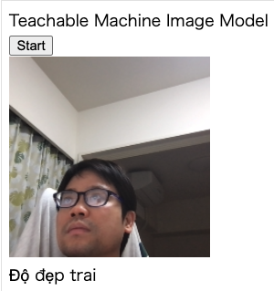
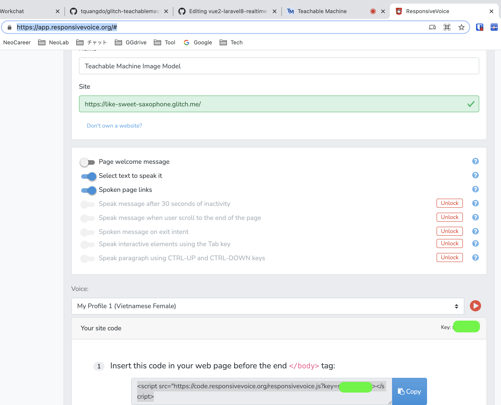
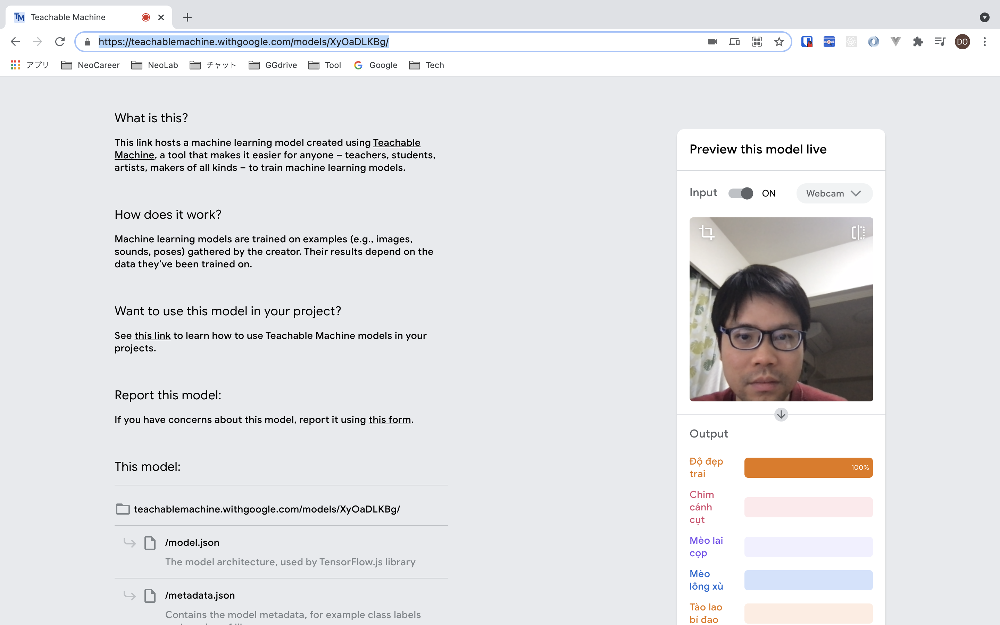

# glitch-teachablemachine-responsivevoice-image-process 🐳

[](https://github.com/tquangdo/glitch-teachablemachine-responsivevoice-image-process/issues/new)


## run

### deploy
- copy paste:
1. responsivevoice: `index.html: <script src="https://code.responsivevoice.org/responsivevoice.js?key=XXX"></script>`

2. teachablemachine: `index.html:`
```html
<script src="https://cdn.jsdelivr.net/npm/@tensorflow/tfjs@1.3.1/dist/tf.min.js"></script>
<script src="https://cdn.jsdelivr.net/npm/@teachablemachine/image@0.8/dist/teachablemachine-image.min.js"></script>
```


### run on browser
- `https://ai-ggvoice-dotq.glitch.me/`

Welcome to Glitch
=================

Click `Show` in the header to see your app live. Updates to your code will instantly deploy and update live.

**Glitch** is the friendly community where you'll build the app of your dreams. Glitch lets you instantly create, remix, edit, and host an app, bot or site, and you can invite collaborators or helpers to simultaneously edit code with you.

Find out more [about Glitch](https://glitch.com/about).


Your Project
------------

### ← README.md

That's this file, where you can tell people what your cool website does and how you built it.

### ← index.html

Where you'll write the content of your website. 

### ← style.css

CSS files add styling rules to your content.

### ← script.js

If you're feeling fancy you can add interactivity to your site with JavaScript.

### ← assets

Drag in `assets`, like images or music, to add them to your project

Made by [Glitch](https://glitch.com/)
-------------------

\ ゜o゜)ノ
